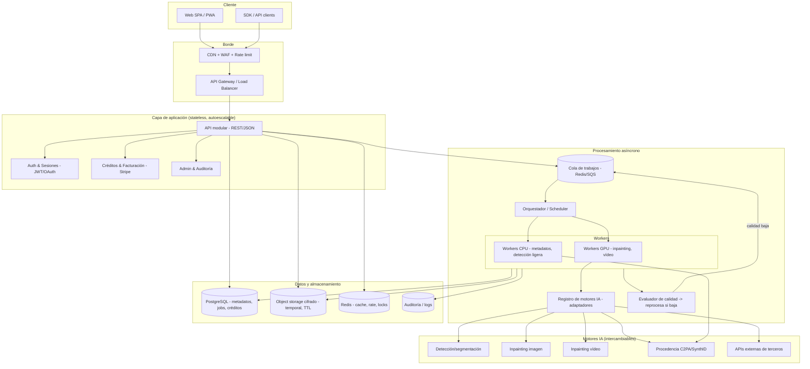
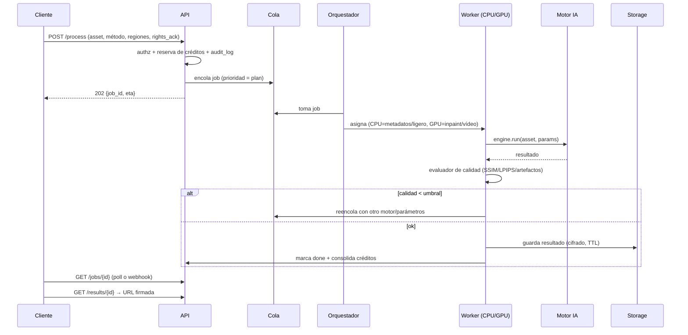

# Gestor de Marcas de Agua IA — Arquitectura de producto SaaS

> Blueprint de producción. Documenta el sistema completo pensado para escalar de 100 a 100.000
> usuarios. La app entregada en `apps/gestor-marcas-agua-ia.html` es el **frontend/MVP funcional**
> de este SaaS: hace procesamiento **real en el navegador** donde es posible (lectura y limpieza de
> metadatos/procedencia, inpainting aproximado, sustitución/añadido de marca, visor antes/después) y
> **simula y avisa** lo que exige backend/GPU (modelos de estudio, coherencia temporal de vídeo,
> cobros reales, multiusuario). Este documento es el plano para llevarlo a producción real.
>
> ⚠️ **Uso responsable.** Todo el producto está diseñado para operar sobre **contenido propio o
> con autorización**. No se diseña para eludir la procedencia de material protegido de terceros.
> Ver §9 (Seguridad y uso responsable).

---

## 1. Análisis de requisitos

### 1.1 Requisitos funcionales (del briefing)

| # | Capacidad | Real en MVP (navegador) | Producción (backend) |
|---|-----------|--------------------------|----------------------|
| F1 | Detección de marca de agua (posición, tamaño, transparencia, tipo) | Heurística en canvas + confirmación del usuario | Modelo de segmentación (U²-Net / SAM / detector propio) |
| F2 | Detección de marca "escrita en el código" (metadatos/procedencia) | **Real**: EXIF, XMP, chunks PNG, C2PA/JUMBF, firmas IA | Igual + verificación criptográfica C2PA |
| F3 | Diferenciar marca de agua de elementos naturales | Heurística (bordes/varianza/regularidad) | Clasificador entrenado |
| F4 | Vista previa de zonas detectadas antes de modificar | **Real** (overlay de cajas) | Igual |
| F5 | Eliminar / ocultar / sustituir / modificar marca (con derechos) | **Real** aproximado (inpaint difusión, clon, difuminado) | Inpainting generativo (LaMa, MAT, SD-inpaint) |
| F6 | Reconstrucción visual / inpainting natural | Difusión de vecinos + clonado | Modelos SOTA en GPU |
| F7 | Coherencia temporal en vídeo | Simulado + aviso | Propagación óptica + inpainting de vídeo (E2FGVI, ProPainter) |
| F8 | Preservar resolución/nitidez/iluminación/textura | **Real** (trabaja a resolución nativa) | Igual + control de calidad |
| F9 | Sustitución de marca: logo propio, posición, tamaño, transparencia, nueva marca, versiones | **Real** | Igual |
| F10 | Sección específica de contenido IA + arquitectura modular de motores | **Real** (registro de motores enchufables) | Registry + adaptadores de API |
| F11 | Imágenes PNG/JPG/WEBP (+TIFF cuando sea viable) | PNG/JPG/WEBP reales; TIFF: aviso | +TIFF/AVIF/HEIC server-side |
| F12 | Vídeo MP4/MOV/WEBM, por lotes, GPU | UI + primer fotograma + simulado | Cola + workers GPU + ffmpeg |
| F13 | Comparación antes/después (slider, zoom, pan, resolución, tamaño, formato) | **Real** | Igual |
| F14 | Términos, política de contenido, registro de acciones, control de abuso, límites | **Real** (consentimiento, log, límites, rate-limit local) | +WAF, verificación de identidad, moderación |
| F15 | Dashboard, editor, historial, ajustes, créditos, API | **Real** (localStorage) | +BD, auth, facturación |
| F16 | Créditos y monetización (Stripe-ready) | Simulado (Stripe-ready) | Stripe real + webhooks |
| F17 | API pública (`/analyze`, `/process`, `/job/{id}`, `/result/{id}`) | Documentada + simulada | Real (FastAPI + colas) |
| F18 | Privacidad: cifrado, borrado automático, no-entrenamiento | **Real** (nada sale del dispositivo) + config borrado | TLS + cifrado en reposo + retención |

### 1.2 Requisitos no funcionales
- **Rendimiento:** carga de la UI < 2 s; procesamiento de imagen fluido; API p95 < 300 ms (sin contar el job).
- **Escalabilidad:** de 100 a 100.000 usuarios sin reescritura (horizontal, stateless, colas).
- **Disponibilidad:** 99,9 % objetivo; workers reintentables; jobs idempotentes.
- **Seguridad y privacidad:** *by design*; cifrado en tránsito y reposo; borrado automático; principio de mínimo dato.
- **Mantenibilidad:** modular; motores de IA intercambiables; contratos versionados; observabilidad.
- **Cumplimiento:** RGPD/LSSI (UE), C2PA/Content Credentials, política de uso responsable.

### 1.3 Actores
Usuario final (propietario del contenido) · Cliente de API (integraciones) · Admin/operador · Sistema de procesamiento (workers) · Proveedores de IA (motores).

---

## 2. Arquitectura completa

Arquitectura **modular, asíncrona y stateless** en el borde, con procesamiento pesado desacoplado por colas.



**Principios**
1. **Stateless en el borde** → escala horizontal trivial detrás del balanceador.
2. **Desacople por colas** → picos de carga no tumban la API; los jobs se drenan a ritmo de los workers.
3. **Motores intercambiables** → cada modelo de IA es un adaptador tras una interfaz común (`Engine`); se activa/desactiva por config y feature-flags.
4. **Almacenamiento temporal con TTL** → los archivos de usuario viven lo justo y se borran solos.
5. **Todo auditado** → cada acción sensible deja rastro (registro de acciones) para uso responsable y cumplimiento.

---

## 3. Stack tecnológico (y por qué)

| Capa | Elección | Motivo |
|------|----------|--------|
| Frontend | **Next.js (React) + TypeScript**, PWA | SSR/edge, DX, ecosistema; canvas/WebGL para el editor; instalable |
| Estilo | **Tailwind + Radix/shadcn**, modo oscuro | Diseño premium consistente y accesible |
| Procesamiento en cliente | **Canvas 2D / WebGL / WebCodecs / WASM** | Metadatos y pre-procesado sin subir nada (privacidad) |
| API | **FastAPI (Python)** | Async nativo, tipado (Pydantic), OpenAPI автоgenerado; Python = ecosistema IA |
| Auth | **JWT corto + refresh**, OAuth (Google/GitHub), claves de API con scopes | Estándar, sin estado en el borde |
| Cola | **Redis + RQ/Celery** (arranque) → **SQS/Cloud Tasks** (escala) | Simple al inicio, gestionado al crecer |
| Workers | **Python (Celery)**, contenedores; pool CPU y pool **GPU** | Aísla el trabajo pesado; escala por tipo |
| IA | **PyTorch**; servido con **Triton/TorchServe**; adaptadores por modelo | SOTA de inpainting/segmentación; multi-modelo |
| BD | **PostgreSQL** (+ `pgvector` para huellas/similitud) | Transaccional, fiable, extensible |
| Cache/estado efímero | **Redis** | Cache, rate-limit, locks, idempotencia |
| Almacenamiento | **S3/GCS** con **SSE (cifrado en reposo)** + lifecycle TTL | Barato, duradero, borrado automático |
| Pagos | **Stripe** (Checkout + Billing + Webhooks) | Estándar de facturación por suscripción/créditos |
| Infra | **Docker + Kubernetes** (HPA), Terraform | Autoescalado, IaC, portabilidad |
| Observabilidad | **OpenTelemetry + Prometheus/Grafana + Sentry** | Métricas, trazas, errores |
| CDN/WAF | **Cloudflare** | Borde, rate-limit, protección |

---

## 4. Componentes principales

- **Web SPA/PWA** — subida (drag&drop), editor (canvas), visor antes/después, dashboard, historial, ajustes, créditos, API keys. Pre-procesa en cliente para privacidad.
- **API Gateway** — TLS, rate-limit por clave/IP, autenticación, enrutado, límites de tamaño.
- **Servicio de API (FastAPI)** — endpoints REST; valida, autoriza, tarifica (créditos), encola jobs, expone estado/resultado.
- **Servicio de Auth** — usuarios, sesiones, OAuth, claves de API con scopes y cuotas.
- **Servicio de Créditos/Facturación** — saldo, planes, consumo por operación, integración Stripe, reconciliación por webhook.
- **Orquestador de jobs** — prioriza (plan del usuario), enruta a pool CPU/GPU, reintentos con backoff, idempotencia.
- **Registro de motores IA (`EngineRegistry`)** — interfaz común; adaptadores para cada modelo/versión/proveedor; selección por tipo de tarea, calidad y coste; feature-flags y A/B.
- **Evaluador de calidad** — puntúa el resultado (nitidez, artefactos, SSIM/LPIPS vs. entorno); si baja del umbral, reintenta con otro motor/parámetros.
- **Almacenamiento temporal** — object storage cifrado con TTL; URLs firmadas de corta vida.
- **Auditoría** — registro de acciones (quién, qué, cuándo, sobre qué archivo, con qué declaración de derechos).
- **Panel de administración** — usuarios, jobs, consumo, límites, banderas de abuso, motores activos.

---

## 5. Estructura de carpetas (monorepo)

```
watermark-saas/
├─ apps/
│  ├─ web/                     # Next.js (SPA/PWA)
│  │  ├─ app/                  # rutas: dashboard, editor, historial, ajustes, precios, api, legal, admin
│  │  ├─ components/           # visor, slider antes/después, dropzone, herramientas del editor
│  │  ├─ lib/
│  │  │  ├─ canvas/            # detección heurística, inpaint cliente, marca de agua
│  │  │  ├─ metadata/          # parsers EXIF/XMP/PNG/C2PA (procedencia "en el código")
│  │  │  └─ api-client/        # SDK tipado del backend
│  │  └─ public/               # manifest PWA, iconos, service worker
│  └─ admin/                   # panel de operador (opcional, o ruta protegida en web)
├─ services/
│  ├─ api/                     # FastAPI
│  │  ├─ routers/              # analyze, process, jobs, results, auth, billing, keys, admin
│  │  ├─ core/                 # config, seguridad, rate-limit, dependencias
│  │  ├─ models/               # ORM (SQLAlchemy) + esquemas Pydantic
│  │  └─ services/             # créditos, storage, colas, auditoría
│  └─ worker/                  # Celery
│     ├─ tasks/                # analyze_image, process_image, process_video, quality_check
│     └─ engines/              # ⬅ registro de motores IA
│        ├─ base.py            # interfaz Engine (detect/inpaint/provenance)
│        ├─ detect_*.py        # segmentación de marca
│        ├─ inpaint_*.py       # LaMa / MAT / SD-inpaint
│        ├─ video_*.py         # ProPainter / E2FGVI
│        ├─ provenance_*.py    # C2PA / SynthID / firmas
│        └─ registry.py        # selección por tarea/calidad/coste
├─ packages/
│  ├─ shared-types/            # contratos compartidos (OpenAPI → TS)
│  └─ ui/                      # design system
├─ infra/
│  ├─ docker/                  # Dockerfiles (api, worker-cpu, worker-gpu, web)
│  ├─ k8s/                     # deployments, HPA, colas, secrets
│  └─ terraform/               # BD, storage, red, CDN
├─ migrations/                 # Alembic
├─ tests/                      # unit + integración + carga
└─ docs/                       # este blueprint, ADRs, runbooks
```

---

## 6. Base de datos (PostgreSQL)

Esquema principal (simplificado). IDs `uuid`, marcas de tiempo `timestamptz`, borrado lógico donde aplica.

```sql
-- Usuarios y acceso
users(id, email UNIQUE, password_hash, name, plan, created_at, deleted_at)
oauth_accounts(id, user_id→users, provider, provider_uid, UNIQUE(provider,provider_uid))
api_keys(id, user_id→users, name, prefix, hash, scopes[], rate_limit, revoked_at, last_used_at)

-- Créditos y facturación
credit_wallets(id, user_id→users UNIQUE, balance INT, updated_at)
credit_ledger(id, user_id→users, delta INT, reason, ref_job_id, created_at) -- inmutable
plans(id, code, name, monthly_credits, price_cents, features JSONB)
subscriptions(id, user_id→users, plan_id→plans, stripe_sub_id, status, current_period_end)
invoices(id, user_id→users, stripe_invoice_id, amount_cents, status, created_at)

-- Archivos y trabajos
assets(id, user_id→users, kind['image'|'video'], mime, width, height, bytes,
       storage_key, checksum, has_provenance BOOL, provenance JSONB,
       rights_declared BOOL, expires_at, created_at, deleted_at)   -- TTL vía expires_at
jobs(id, user_id→users, asset_id→assets, type['analyze'|'process_image'|'process_video'],
     engine, params JSONB, status['queued'|'running'|'done'|'failed'|'needs_review'],
     priority INT, credits_cost INT, quality_score NUMERIC,
     result_key, error, attempts INT, created_at, started_at, finished_at)
detections(id, asset_id→assets, bbox JSONB, kind['visual'|'metadata'], confidence, type, meta JSONB)

-- Uso responsable y auditoría
audit_log(id, user_id→users, action, asset_id, ip, user_agent, rights_ack BOOL,
          detail JSONB, created_at)              -- inmutable, append-only
usage_counters(user_id→users, window, images INT, videos INT, hires INT)  -- límites/abuso
```

Índices clave: `jobs(status, priority, created_at)` (drenado de cola), `assets(user_id, created_at)`,
`assets(expires_at)` (barredor de TTL), `credit_ledger(user_id, created_at)`, `audit_log(user_id, created_at)`.
`pgvector` opcional en `detections.meta` para huellas de marcas conocidas (similitud).

---

## 7. APIs

REST/JSON, versionada (`/v1`), OpenAPI autogenerado. Autenticación por **JWT** (web) o **clave de API** (integraciones).

| Método | Ruta | Descripción | Coste |
|--------|------|-------------|-------|
| POST | `/v1/assets` | Sube un archivo → URL firmada + `asset_id` | 0 |
| POST | `/v1/analyze` | Analiza (detección visual + procedencia). Body: `{asset_id}` | bajo |
| POST | `/v1/process` | Procesa. Body: `{asset_id, method, regions[], watermark?, keep_metadata}` → `job_id` | según tipo |
| GET | `/v1/jobs/{id}` | Estado del job `{status, progress, quality_score}` | 0 |
| GET | `/v1/results/{id}` | Resultado (URL firmada de corta vida) | 0 |
| POST | `/v1/keys` | Crea clave de API con scopes | 0 |
| GET | `/v1/credits` | Saldo y plan | 0 |
| POST | `/v1/billing/checkout` | Sesión de Stripe Checkout | 0 |
| POST | `/webhooks/stripe` | Reconciliación de pagos (firma verificada) | — |

**Contrato de ejemplo**

```http
POST /v1/process
Authorization: Bearer sk_live_…
Content-Type: application/json

{ "asset_id":"a_123", "method":"inpaint", "regions":[{"x":12,"y":18,"w":120,"h":40}],
  "keep_metadata":false, "rights_ack":true }

202 Accepted
{ "job_id":"j_789", "status":"queued", "credits_cost":4, "eta_seconds":15 }
```

**Reglas transversales**
- **Autenticación** obligatoria; scopes por clave (`analyze`, `process`, `read`).
- **Rate limit** por clave/IP (token-bucket en Redis); cuotas por plan.
- **Control de costes**: cada operación descuenta créditos *antes* de encolar (reserva) y consolida al terminar; si falla, se reembolsa.
- **Idempotencia**: cabecera `Idempotency-Key` para POST.
- **`rights_ack` obligatorio** en `/process`: declaración de derechos registrada en auditoría.
- Errores con formato problem+json; paginación por cursor.

---

## 8. Sistema de procesamiento



- **Colas por tipo/prioridad**: `images-cpu`, `images-gpu`, `video-gpu`; usuarios de plan alto = mayor prioridad.
- **Workers autoescalables**: HPA por longitud de cola y uso de GPU; pool GPU independiente (caro, escala aparte).
- **Registro de motores**: `registry.select(task, quality_target, cost_budget)` → adaptador concreto (versión fijada, feature-flag, A/B).
- **Vídeo**: extracción de fotogramas (ffmpeg) → detección/propagación de máscara → inpainting con **coherencia temporal** (flujo óptico) → re-ensamblado → re-encode; por lotes y en GPU.
- **Evaluador de calidad**: mide y decide reproceso automático (requisito §13 del briefing). Umbrales por tipo de contenido.
- **Idempotencia y reintentos**: `attempts` con backoff exponencial; jobs idempotentes por `Idempotency-Key`.
- **Batch**: múltiples assets en un job padre con hijos (fan-out) para procesamiento por lotes.

---

## 9. Seguridad y uso responsable

**Autenticación/autorización**
- JWT de vida corta + refresh; contraseñas con Argon2; OAuth.
- Claves de API con hash (nunca en claro), scopes y cuotas; rotación y revocado.
- Autorización por propietario: un usuario solo toca **sus** assets.

**Uso responsable (núcleo del producto)**
- **Declaración de derechos obligatoria** (`rights_ack`) antes de eliminar/modificar cualquier marca; queda en `audit_log`.
- **Términos de uso + política de contenido** aceptados en el registro.
- **Registro de acciones** append-only: quién, qué, cuándo, sobre qué archivo.
- **Controles de abuso**: límites por usuario/plan (imágenes/vídeos/alta-res por ventana), detección de patrones anómalos, verificación reforzada para volumen alto, listas de bloqueo, moderación.
- **No elusión de terceros**: el producto no ofrece "sube cualquier cosa protegida y te la limpio"; el foco es contenido propio/autorizado, con fricción deliberada (declaración + auditoría + límites).
- **Procedencia**: se *detecta y muestra* la procedencia (C2PA/SynthID/firmas) y, al reescribir, se puede **conservar/añadir Content Credentials** en vez de solo borrarlas.

**Datos y aplicación**
- TLS 1.2+ en tránsito; SSE/KMS en reposo; secretos en gestor (no en código).
- Validación estricta de tipo/tamaño; sanitización; CSP estricta; escape de todo dato de usuario (anti-XSS).
- Aislamiento de workers (sandbox, sin red saliente salvo motores permitidos).
- WAF + rate-limit en el borde; protección contra subida maliciosa (verificación de cabeceras mágicas, no solo extensión).

**Privacidad (§15)**
- **Nada de tracking**; mínimo dato personal.
- **Borrado automático configurable** (TTL de assets y resultados) + borrado inmediato a demanda.
- **No se usan archivos de usuario para entrenar** sin consentimiento explícito y revocable.
- Portabilidad y derecho de supresión (RGPD).

---

## 10. Escalado de 100 a 100.000 usuarios

| Dimensión | 100 usuarios (v1) | 10.000 | 100.000 |
|-----------|-------------------|--------|---------|
| Web | 1 contenedor / edge | CDN + varias réplicas | CDN global, edge cache agresivo |
| API | 1–2 réplicas | HPA 5–20 réplicas stateless | Autoescalado + regiones múltiples |
| Cola | Redis único | Redis HA / SQS | SQS/Cloud Tasks gestionado, colas por tipo |
| Workers CPU | 1–2 | HPA por cola | Cientos, multi-zona |
| Workers GPU | 1 (o on-demand) | Pool GPU con autoescalado | Pool GPU multi-región + spot; batching |
| PostgreSQL | 1 instancia | Réplicas de lectura + PgBouncer | Particionado (por `user_id`), réplicas, archivado |
| Storage | Bucket con TTL | + lifecycle + multi-AZ | Multi-región, clases frías para lo poco que persista |
| Cache | Redis | Redis cluster | Redis cluster + cache de resultados idempotentes |
| Facturación | Stripe | Stripe + reconciliación | Igual (Stripe ya escala) |
| Observabilidad | Sentry + logs | +Prometheus/Grafana | +Trazas distribuidas, SLOs, alertas |

**Palancas de escala**
1. **Stateless + colas** → añadir réplicas y workers es lineal; los picos se absorben en la cola.
2. **Separar CPU de GPU** → lo caro (GPU) escala por su cuenta y con *batching* para amortizar.
3. **Cache de idempotencia** → mismas entradas no se reprocesan.
4. **BD**: réplicas de lectura primero; particionado por `user_id` cuando el volumen lo exija.
5. **Storage efímero con TTL** → el coste de almacenamiento no crece con los usuarios, sino con el trabajo *en vuelo*.
6. **Multi-región** al final: datos y GPU cerca del usuario; conmutación por error.
7. **Coste bajo control**: reserva de créditos por operación + presupuestos por motor + spot GPU + degradación elegante (motor más barato si el presupuesto aprieta).

---

## Implementación de referencia (ya construida): `services/watermark-api`

El backend de este blueprint **está implementado y verificado** en `services/watermark-api` (FastAPI),
integrando el motor real **[`remove-ai-watermarks`](https://github.com/wiltodelta/remove-ai-watermarks)**
(Apache-2.0). Correspondencia con este documento:

| Este blueprint | Implementado en |
|----------------|-----------------|
| API modular (`/analyze`, `/process`, `/jobs`, `/results`) | `app/main.py` |
| Registro de motores intercambiables (§4, apéndice) | `app/engine.py` (remove-ai-watermarks ↔ nativo) |
| Detección de procedencia C2PA/EXIF/XMP/firmas | `identify` real + `app/native_meta.py` (fallback CPU) |
| Borrado de marcas ocultas (metadatos) | `metadata.strip_and_verify` (o nativo) |
| Marca visible (opencv, CPU) / invisible (SynthID, GPU) | `remove_visible` / `remove_all` |
| Auth por clave, rate limit, `rights_ack`, registro de acciones (§9) | `app/security.py` |
| Almacenamiento temporal con TTL (§9, privacidad) | `app/store.py` |
| Cola de trabajos asíncrona (§8) | `ThreadPoolExecutor` (sustituible por Redis/SQS al escalar) |

Estado: **CPU verificado** (identify + metadata + visible corren y pasan tests + demo HTTP real). El
borrado de marca **invisible/SynthID** requiere `remove-ai-watermarks[diffusion]` y **GPU (CUDA)**; el
servicio lo expone y degrada a `unavailable` cuando no hay GPU. El frontend `apps/gestor-marcas-agua-ia.html`
lo consume cuando se configura su URL en Ajustes (con fallback local). Ver `services/watermark-api/README.md`.

## Apéndice — Interfaz de motor (contrato de extensión)

```python
class Engine(Protocol):
    name: str; version: str; task: Literal['detect','inpaint_image','inpaint_video','provenance']
    cost: int          # créditos estimados
    def run(self, asset: Asset, params: dict) -> Result: ...
    def score(self, result: Result) -> float: ...   # 0..1 calidad
# El registro elige por (task, calidad objetivo, presupuesto) y permite A/B y feature-flags.
# Añadir un modelo nuevo = añadir un adaptador; el resto del sistema no cambia. (Requisito §16)
```

Este contrato es lo que hace el sistema **preparado para el futuro**: nuevos modelos de imagen/vídeo,
restauración, procedencia o APIs de terceros entran como adaptadores sin tocar API, colas ni frontend.
